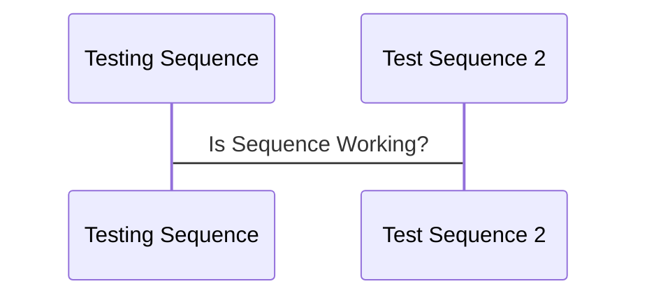
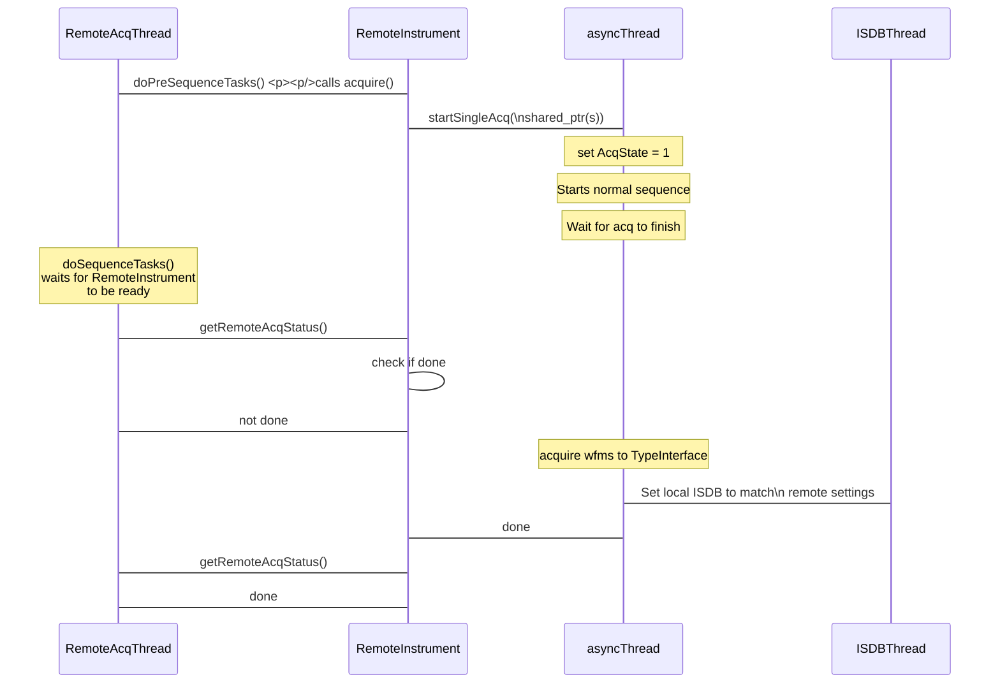

# test_markdown

```mermaid
sequenceDiagram
Testing Sequence->Test Sequence 2:Is Sequence Working?

```

```mermaid
sequenceDiagram

RemoteAcqThread->RemoteInstrument: doPreSequenceTasks() <p><p/>calls acquire();
RemoteInstrument->asyncThread: startSingleAcq(\nshared_ptr(s))
Note over asyncThread: set AcqState = 1
Note over asyncThread: Starts normal sequence
Note over asyncThread: Wait for acq to finish
Note over RemoteAcqThread: doSequenceTasks()<br/>waits for RemoteInstrument<br/> to be ready
RemoteAcqThread->RemoteInstrument: getRemoteAcqStatus()
RemoteInstrument->RemoteInstrument: check if done
RemoteInstrument->RemoteAcqThread: not done
Note over asyncThread: acquire wfms to TypeInterface
asyncThread->ISDBThread: Set local ISDB to match\n remote settings
asyncThread->RemoteInstrument: done
RemoteAcqThread->RemoteInstrument: getRemoteAcqStatus()
RemoteInstrument->RemoteAcqThread: done
```
